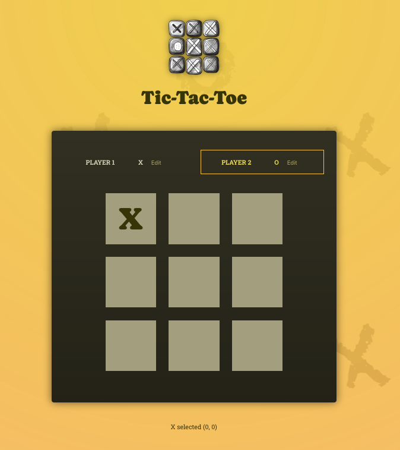
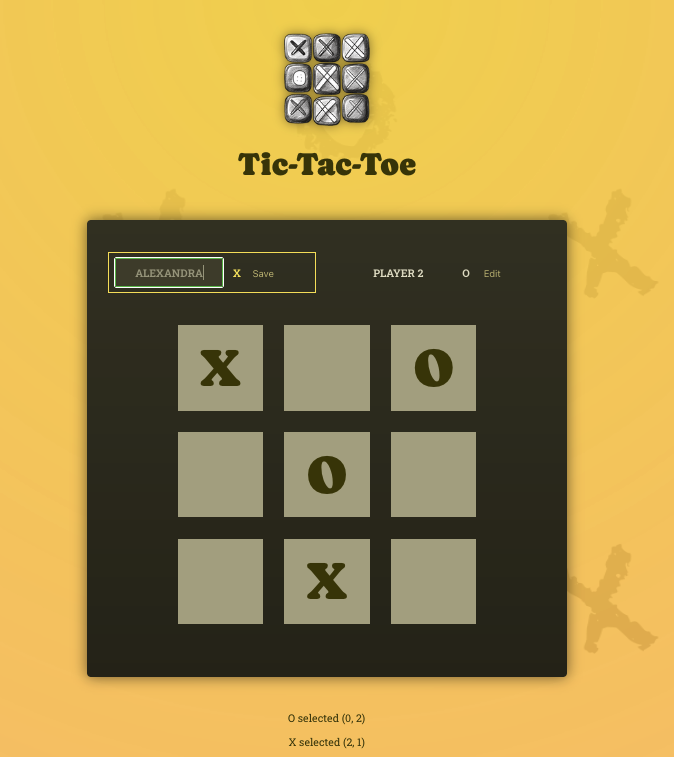
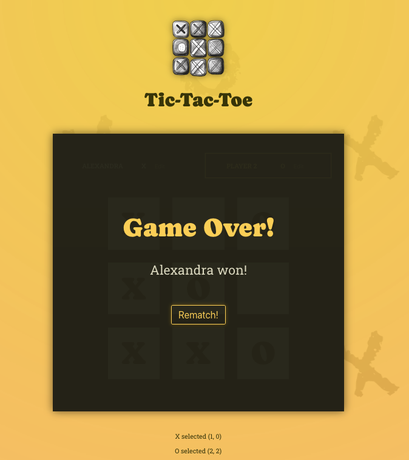

## Tic tac toe game

Yet another implementation of the game. Here are the lessons that I've learned during this deeper dive into React:
- React State: React is scheduling state updates, not performing them instantly. By using the function form to set new state values, we can expect correct values to be set
- Immutability when updating object State (reference values, deep copy)
- Two way Binding
- Lifting State up to the closest ancestor component
- Overriding a value in a structure at state change

### How to run the project
Install the project:
> `$ npm install` 
 
To start the development server:
> `$ npm run dev` 

## Project final look

#### Player 1 made the first move, now it's Player 2's turn

#### Editing Player 1's name

#### Player 1 has won

